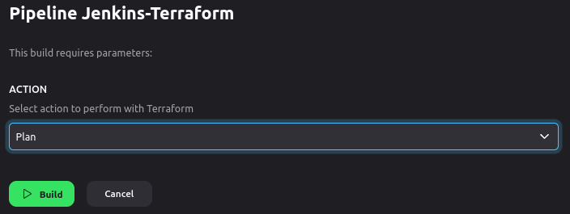

# Jenkins Terraform Pipeline for AWS

This repository automates AWS infrastructure management with Terraform via Jenkins.

## Files

- `Jenkinsfile`: Jenkins pipeline script.
- `main.tf`, `outputs.tf`: Terraform configuration files.
- `README.md`: Project overview.

## Pipeline

1. **Checkout**: Clones the project from GitHub.
2. **Terraform Init**: Initializes Terraform, generates a plan.
3. **Terraform Action**: Applies, plans, or destroys infrastructure based on user input.

## Parameters

- **ACTION**: Choose `Apply`, `Plan`, or `Destroy`.

## Preview

## Usage

1. Set up Jenkins with AWS and Terraform plugins.
2. Link Jenkins to this repository.
3. Configure AWS credentials in Jenkins.
4. Run the pipeline, select action.
